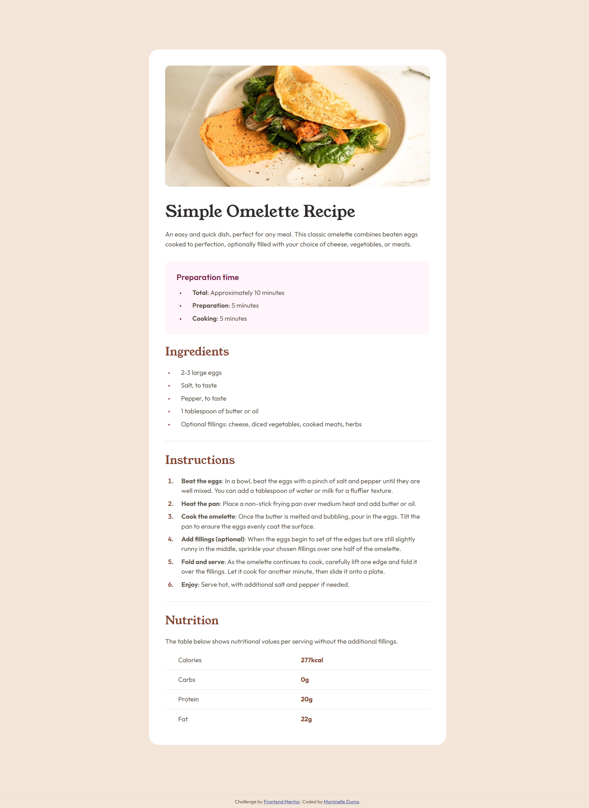

# Frontend Mentor - Recipe page solution

This is a solution to the [Recipe page challenge on Frontend Mentor](https://www.frontendmentor.io/challenges/recipe-page-KiTsR8QQKm). Frontend Mentor challenges help you improve your coding skills by building realistic projects. 

## Table of contents

- [Overview](#overview)
  - [The challenge](#the-challenge)
  - [Screenshot](#screenshot)
  - [Links](#links)
- [My process](#my-process)
  - [Built with](#built-with)
  - [What I learned](#what-i-learned)
  - [Continued development](#continued-development)
- [Author](#author)

## Overview

### The challenge

Users should be able to:
- View the optimal layout depending on their device's screen size
- See properly formatted recipe sections (ingredients, instructions, nutrition)

### Screenshot

### Links

- Solution URL: [https://github.com/Marimelle/recipe-page](https://github.com/Marimelle/recipe-page)
- Live Site URL: [https://marimelle.github.io/recipe-page/](https://marimelle.github.io/recipe-page/)

## My process

### Built with

- Semantic HTML5 markup
- CSS custom properties
- Flexbox
- CSS Grid
- Mobile-first workflow
- Responsive typography (rem units)

### What I learned

Key takeaways from this project:

- **CSS Variable Organization**:
Structured color and font variables in `:root` for easy theme management and consistency across components.

- **Responsive Image Handling**:
Combined relative units `vw` and `rem` for minimum height to ensure the image adapts beautifully across devices.

- **Accessibility Focus**:
Prioritized semantic HTML and appropriate heading hierarchy to ensure the recipe is usable for all audiences, including screen reader users.

- **Problem Solving**: Created own mockup using Figma since I only had access to the screenshot of the design and got better at using browser tools to test my design

### Continued development
- I faced challenges in accurately measuring elements and spacing since I only had a screenshot of the design to work with. Without access to the original Figma file, I had to recreate the entire layout manually in Figma.
- Fortunately, all those Figma tutorials and practice projects I did on my own really paid off. I was able to figure it out and finish my mockup on Figma.

## Author
- Github - [Marimelle Dumo](https://github.com/Marimelle)
- Frontend Mentor - [Marimelle](https://www.frontendmentor.io/profile/Marimelle)